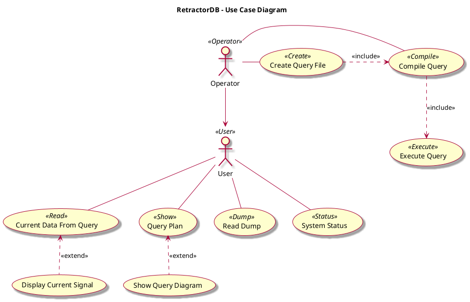

# RetractorDB:system

[comment]: # (VSCode view: Ctrl+k,v)

## RetractorDB - system

* [retractor](retractor/README.md)
* [xtrdb](rdb/README.md)
* [xqry](qry/README.md)

## UML System Perspective - Use Case Diagram

