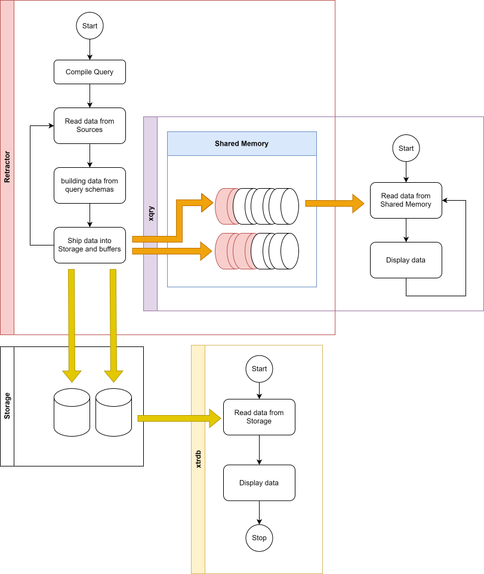

# RetractorDB:system

[comment]: # (VSCode view: Ctrl+k,v)

## RetractorDB - system

* [retractor](retractor/README.md)
* [xtrdb](rdb/README.md)
* [xqry](qry/README.md)

`xretractor` compiles and executes RQL plans, `xqry` communicates with live instances over IPC, and `xtrdb` inspects or prepares persisted storage offline. Several named `xretractor` instances can run at the same time. Each instance has its own lock and IPC objects, while the shared `xrdbbus` registry publishes the live instances and prevents conflicting ownership of stream and storage names.

## UML System Perspective - Use Case Diagram

## Draw.io - simplified single-instance data flow

The older overview below illustrates the main data path for one instance. It does not show instance-specific IPC objects or the shared `xrdbbus` registry.

