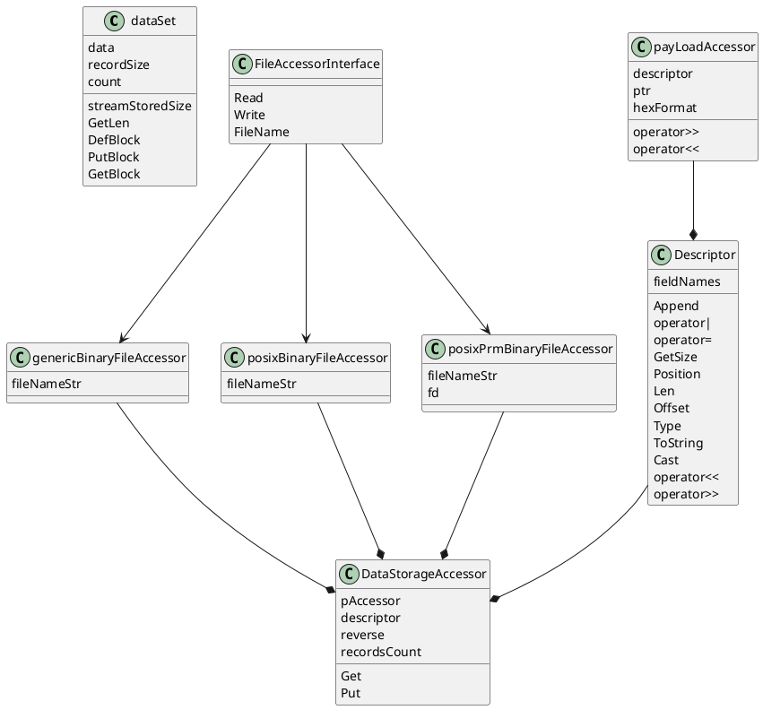

# RetractorDB:Rdb Headers descripton

Following headers are in include/rdb directory are:

file name|Type name|description|temporary
:--|---|---|--:
dataset.h|dataSet|This file creates abstraction that emulates CBuffer interface set|yes
desc.h|Descriptor|Description - this object creates ability to create descritons of binary frames using types and arrays|no
faccfs.h|genericBinaryFileAccessor|File Accessor as File system - type. This is underlaying type that supports access to binary fields. std::fstream is used as interface. :Rdb user does not need to use this object directly|?
faccposix.h|posixBinaryFileAccessor|File Accessor as Posix - type. This is underlaying type that supports access to binary fields. Posix functions are used as interface. :Rdb user does not need to use this object directly|?
faccposixprm.h|posixPrmBinaryFileAccessor|File Accessor as Posix Permamanet - type. This is underlaying type that supports access to binary fields. Posix functions are used as interface. Difference between faccposix is that file descriptor remains open duiring entire live of obcject :Rdb user does not need to use this object directly. This is development area.|no
fainterface.h|FileAccessorInterface|File Accessor Interface. This is used as pattern for: faccposix, facposixprm and faccfs types. All these types need to support this interface|yes
payloadacc.h|payLoadAccessor|This is accessor for payload memory arrea that suports applaying descriptor type over memory area.|yes

Temporary field means that this file most probably will disapear during next development.

## UML Class schema of :Rdb

[https://www.visual-paradigm.com/guide/uml-unified-modeling-language/uml-aggregation-vs-composition/]: <>

