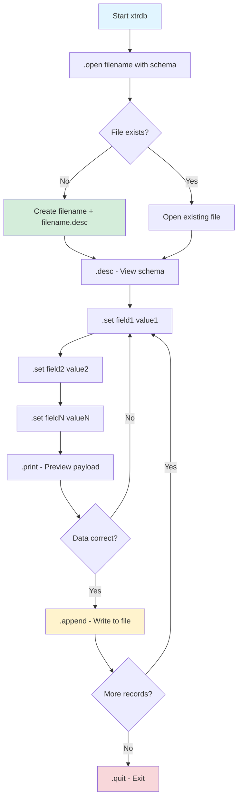
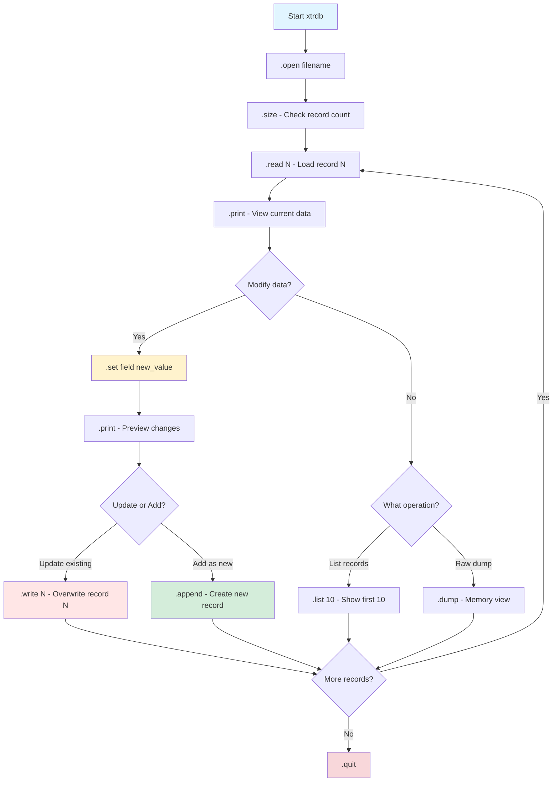
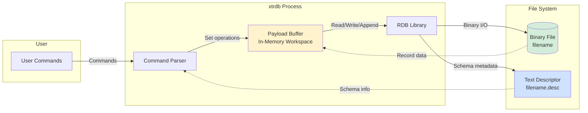
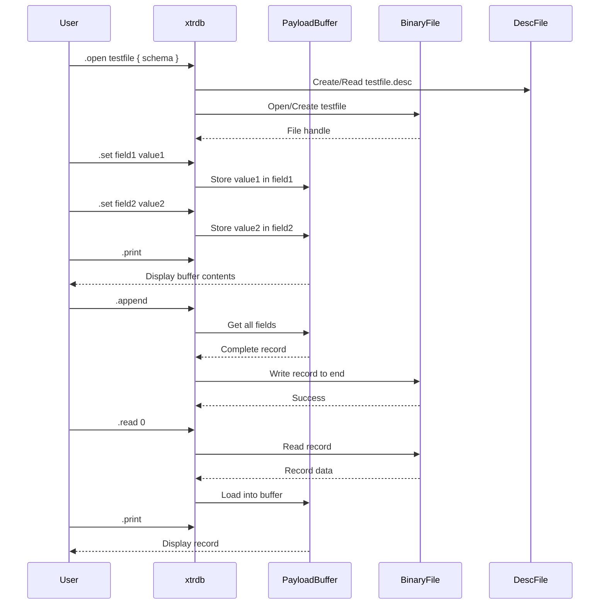

# [RetractorDB](../README.md):xtrdb

[comment]: # (VSCode view: Ctrl+k,v)

## xtrdb - Binary Data Accessor and Testing Tool

**xtrdb** is an interactive terminal-based tool for accessing, inspecting, and manipulating RetractorDB's binary data files (artifacts). It provides a database-like interface for working with time series data stored in RetractorDB's native format.

> :warning: **This is work in progress**: This readme can be outdated.

### Purpose

The `xtrdb` tool serves several key functions:
- **Artifact Inspection**: Examine binary data files generated by xretractor
- **Metadata Analysis**: View and verify data structure schemas
- **Test Data Creation**: Generate test datasets for RetractorDB queries
- **Data Verification**: Validate query results and system behavior
- **Debugging**: Investigate data processing issues

### Key Features

- **Interactive Terminal**: Command-line interface with dot prompt (`.`)
- **Schema Management**: Define and inspect data structures
- **CRUD Operations**: Create, read, update data records
- **Multiple Data Types**: Full support for RetractorDB type system
- **Binary + Metadata**: Automatically manages `.desc` descriptor files
- **Deterministic Testing**: Create reproducible test scenarios

## Supported Data Types

RetractorDB's storage layer supports the following data types:

| Type | Size (bytes) | Range | Description |
| ---  | ---: | --- | --- |
| BYTE  | 1 | 0..255 | 8-bit unsigned byte |
| INTEGER | 4 | -2,147,483,648 to 2,147,483,647 | Signed 32-bit integer |
| UINT | 4 | 0 to 4,294,967,295 | Unsigned 32-bit integer |
| STRING | [declared] | Array of bytes | Fixed-size character array |
| FLOAT | 4 | ±3.4E-38 to ±3.4E+38 | Single precision floating point |
| DOUBLE | 8 | ±1.7E-308 to ±1.7E+308 | Double precision floating point |

**Table 1**: Data types supported by RetractorDB storage layer

### Type Notes

- **STRING**: Must specify array size at declaration (e.g., `STRING name[10]`)
- **BYTE arrays**: Can be used for raw binary data (e.g., `BYTE data[3]`)
- **Type inference**: During query compilation, types are automatically promoted when necessary
- **Alignment**: Storage format is optimized for direct memory access

## Interactive Terminal Interface

### Starting xtrdb

Launch the interactive terminal:
```bash
$ xtrdb
.                               # Dot prompt indicates ready for commands
```

### Available Commands

Type `.help` to see all available commands:

```
.help
exit|quit|q                      Exit xtrdb terminal
quitdrop|qd                      Exit and delete all artifacts
open file [schema]               Open existing file or create new with schema
openx desc file [schema]         Open with explicit descriptor file
                                 Example: .open test_db { INTEGER data STRING name[3] }
desc|descc                       Display current schema/structure
read [n]                         Read record number n into payload buffer
write [n]                        Write payload buffer to record number n
append                           Append payload buffer as new record
set [field] [value]              Set field value in payload buffer
setpos [position] [num value]    Set field at position to value
status                           Show current payload buffer status
rox                              Toggle "remove on exit" flag
print|printt                     Display payload buffer contents
list|rlist [value]               List first/last n records
input [[field][value]]           Fill payload with values
hex|dec                          Toggle hex/decimal display mode
size                             Show total records in database
cap [value]                      Set stream backread capacity
dump                             Show raw payload memory dump
mono                             Toggle color/monochrome mode
echo                             Print message to terminal
ok
.
```

### Command Categories

**File Operations:**
- `open`, `openx` - Open or create storage files
- `exit`, `quit`, `quitdrop` - Close and exit

**Schema Operations:**
- `desc` - View structure
- `size` - Get record count

**Data Operations:**
- `read`, `write`, `append` - Record I/O
- `list`, `rlist` - Bulk viewing

**Payload Buffer:**
- `set`, `setpos` - Modify fields
- `print`, `printt` - Display
- `status` - View state
- `dump` - Raw memory view

## Usage Examples

### Example 1: Creating a New Storage File

This example demonstrates creating a new binary storage file with a complex schema.

**What this example shows:**
- Schema definition syntax
- Multiple data types in one record
- File creation process
- Automatic descriptor file generation

```bash
$ xtrdb
.open testfile { STRING name[5] BYTE data[3] BYTE control INTEGER intdata FLOAT measurement }
ok                              # File created successfully

.desc                            # Display the schema we just created
{       STRING name[5]          # 5-character string field
        BYTE data[3]            # Array of 3 bytes (e.g., sensor readings)
        BYTE control            # Single control byte (flags, status)
        INTEGER intdata         # 32-bit signed integer
        FLOAT measurement       # Floating point measurement value
}
```

**Files created:**
- `testfile` - Binary data file (records)
- `testfile.desc` - Text descriptor file (schema metadata)

**Use case:** Creating test data for a multi-sensor monitoring system where each record contains sensor name, raw data bytes, control flags, integer counters, and floating-point measurements.

### Example 2: Adding Data to Storage

This example shows how to populate a storage file with data using the payload buffer.

**What this example shows:**
- Opening an existing file
- Setting individual field values
- Using the payload buffer
- Appending records
- Different data type assignments

```bash
$ xtrdb
.open testfile                   # Open previously created file
ok

.desc                            # Verify the schema
{       STRING name[5]
        BYTE data[3]
        BYTE control
        INTEGER intdata
        FLOAT measurement
}

# Build a record in the payload buffer (in-memory workspace)
.set name test1                  # Set string field to "test1"
.set data 5 7 8                  # Set byte array to values [5, 7, 8]
.set control 233                 # Set control byte to 233 (0xE9)
.set intdata 345678              # Set integer to 345678
.set measurement 3.1415926       # Set float to π approximation

.print                           # Display payload buffer contents
{       name:test1               # String value
        data:5 7 8               # Byte array values (space-separated)
        control:233              # Control byte
        intdata:345678           # Integer value
        measurement:3.14159      # Float (note: precision limitation)
}

.append                          # Write payload buffer to file as new record
ok                               # Record #0 successfully written
```

**Workflow explanation:**
1. **Payload Buffer**: Acts as a working area (like a clipboard)
2. **Set Operations**: Modify fields in buffer, not in file yet
3. **Append**: Commits buffer contents to file as a new record

**Use case:** Programmatically generating test datasets for time series queries, or manually creating calibration data for sensor systems.

### Example 3: Reading and Modifying Existing Data

This example demonstrates reading records, modifying them, and understanding the difference between `write` and `append`.

**What this example shows:**
- Reading existing records by index
- Modifying fields in the payload buffer
- The difference between `write` (update) and `append` (add new)
- Non-destructive read operations

```bash
$ xtrdb
.open testfile
ok

.read 0                          # Read record #0 into payload buffer
ok                               # Record successfully loaded

.print                           # Display what we just read
{       name:test1               # Original data from record #0
        data:5 7 8
        control:233
        intdata:345678
        measurement:3.14159
}

.set name test2                  # Change name field (only in buffer!)
.print                           # Show modified buffer
{       name:test2               # Name changed to "test2"
        data:5 7 8               # Other fields unchanged
        control:233
        intdata:345678
        measurement:3.14159
}

.append                          # Add as NEW record (not update!)
ok                               # Creates record #1 with "test2"

.read 0                          # Read original record again
ok
.print                           # Verify record #0 is unchanged
{       name:test1               # Still "test1" - append didn't modify it!
        data:5 7 8
        control:233
        intdata:345678
        measurement:3.14159
}
.
```

**Key concepts:**
- **read [n]**: Loads record n into payload buffer (non-destructive)
- **append**: Adds buffer as NEW record at end of file
- **write [n]**: Would UPDATE existing record n (overwrites it)
- Records are 0-indexed: first record is 0, second is 1, etc.

**Important distinction:**
```
.append    → Creates new record (record count increases)
.write 0   → Updates record #0 (record count stays same)
```

**Use case:** Inspecting query output artifacts, creating variations of test data, or debugging data transformation issues.

## Usage Workflows

### Workflow 1: Creating and Populating a New Storage File



**Process:**
1. Start xtrdb terminal
2. Open/create file with schema definition
3. Set field values in payload buffer
4. Preview with `.print`
5. Append to file when satisfied
6. Repeat for multiple records

### Workflow 2: Reading and Modifying Records



**Process:**
1. Open existing file
2. Check size/browse records
3. Load specific record
4. Modify if needed
5. Write back or append new
6. Repeat as needed

### Workflow 3: xtrdb Architecture and Data Flow



**Components:**
- **Command Parser**: Interprets user commands
- **Payload Buffer**: In-memory staging area for records
- **RDB Library**: Core storage access logic
- **Binary File**: Actual data storage
- **Descriptor File**: Schema metadata (text format)

### Workflow 4: Operation Sequence Diagram



**Interaction flow:**
1. File opening creates/opens both binary and descriptor files
2. Set commands modify only the payload buffer (non-persistent)
3. Append/write operations commit buffer to disk
4. Read operations load from disk into buffer
5. Print always displays current buffer state

## Advanced Usage Examples

### Example 4: Working with Byte Arrays

```bash
$ xtrdb
.open sensor_data { STRING id[4] BYTE readings[8] }
ok

# Decimal mode (default)
.dec
.set id SNS1
.set readings 10 20 30 40 50 60 70 80    # Decimal byte values
.print
{       id:SNS1
        readings:10 20 30 40 50 60 70 80
}
.append
ok

# Hexadecimal mode
.hex
.read 0
.print
{       id:SNS1
        readings:0a 14 1e 28 32 3c 46 50  # Same values in hex
}
```

**What this shows:**
- Byte arrays for sensor data
- Switching between decimal and hexadecimal display
- `.hex` and `.dec` commands toggle display mode

### Example 5: Listing and Browsing Records

```bash
$ xtrdb
.open temperature { INTEGER timestamp FLOAT temp_celsius }
ok

# Add several records...
.set timestamp 1000
.set temp_celsius 22.5
.append
ok

.set timestamp 1001
.set temp_celsius 23.1
.append
ok

.set timestamp 1002
.set temp_celsius 21.8
.append
ok

# View all records from start
.list 10                         # List first 10 records
{ timestamp:1000 temp_celsius:22.5 }
{ timestamp:1001 temp_celsius:23.1 }
{ timestamp:1002 temp_celsius:21.8 }

# View from end
.rlist 2                         # List last 2 records (reverse)
{ timestamp:1002 temp_celsius:21.8 }
{ timestamp:1001 temp_celsius:23.1 }

# Check total count
.size
3 records                        # Total records in file
```

**What this shows:**
- `.list N` - Forward listing from start
- `.rlist N` - Reverse listing from end
- `.size` - Total record count
- Useful for verifying data population

### Example 6: Testing RetractorDB Queries

**Scenario:** Create test data for a streaming sum query

```bash
$ xtrdb
.open input_stream { INTEGER value }
ok

# Create ascending sequence for testing
.set value 1
.append
ok

.set value 2
.append
ok

.set value 3
.append
ok

.set value 4
.append
ok

.set value 5
.append
ok

.list 5
{ value:1 }
{ value:2 }
{ value:3 }
{ value:4 }
{ value:5 }

# Now use in RetractorDB query:
# DECLARE value INTEGER
# STREAM input, 1
# FILE 'input_stream'
```

**Use case:** Creating deterministic test inputs for query verification. The output can be compared against expected results to validate query logic.

## Practical Use Cases

### 1. **Test Data Generation**
Create reproducible test datasets for RetractorDB queries:
- Sensor simulation data
- Edge case scenarios
- Performance benchmarking datasets

### 2. **Artifact Inspection**
Examine output from xretractor queries:
```bash
$ xretractor query.rql -m 10     # Run for 10 seconds
$ xtrdb
.open output_stream              # Inspect generated artifact
.list 5                          # View first 5 results
```

### 3. **Data Validation**
Verify query results match expected output:
- Read output artifacts
- Compare field values
- Check data types and ranges

### 4. **Debugging**
Investigate data processing issues:
- Use `.dump` for raw memory view
- Check schema with `.desc`
- Verify record structure

### 5. **Data Conversion**
Transform data between formats:
- Import from text/CSV
- Export to binary format
- Schema migration

### 6. **Query Development**
Iterative query development:
1. Create test input with xtrdb
2. Run query with xretractor
3. Inspect output with xtrdb
4. Refine query logic
5. Repeat

## Best Practices

### DO:
- ✅ Use `.desc` to verify schema before operations
- ✅ Use `.print` to preview before `.append`
- ✅ Use `.size` to check record count
- ✅ Keep descriptor files (.desc) with binary files
- ✅ Use meaningful field names in schemas
- ✅ Test with small datasets first

### DON'T:
- ❌ Mix `.write` and `.append` without understanding difference
- ❌ Delete .desc files manually (breaks schema)
- ❌ Forget to `.quit` properly (may lose data)
- ❌ Use very large STRING arrays unnecessarily
- ❌ Assume float precision is exact

## Tips and Tricks

### Quick Record Creation
```bash
# Method 1: Individual sets
.set field1 value1
.set field2 value2
.append

# Method 2: Using setpos (positional)
.setpos 0 value1
.setpos 1 value2
.append
```

### Batch Operations
```bash
# Create multiple similar records quickly
.set timestamp 1000
.set value 10
.append
.set timestamp 1001    # Only change what differs
.append
.set timestamp 1002
.append
```

### Inspecting Large Files
```bash
.size                  # Get total count first
.list 10               # Sample from start
.rlist 10              # Sample from end
.read 0                # Check first record details
```

### Schema Reuse
```bash
# Save schema for later
.open myfile { INTEGER a FLOAT b }
.desc > myschema.txt   # Save schema definition

# Reuse schema
.openx myschema.txt newfile
```

## Troubleshooting

| Problem | Solution |
|---------|----------|
| "No such file" error | Check filename, create with `.open file { schema }` |
| Schema mismatch | Verify .desc file matches data file |
| Values not saving | Ensure you used `.append` or `.write` |
| Wrong data displayed | Check if you need `.hex` or `.dec` mode |
| Can't modify record | Use `.read N` first, then `.set`, then `.write N` |

## Performance Notes

- **Memory**: Payload buffer size depends on schema complexity
- **I/O**: Sequential reads/writes are optimized
- **Scalability**: Suitable for files with millions of records
- **Determinism**: Operations are deterministic and reproducible

## Integration with RetractorDB

xtrdb complements the RetractorDB ecosystem:

```
┌─────────────┐
│  xretractor │  ← Main processing engine
│   (query)   │
└──────┬──────┘
       │ produces
       ↓
┌─────────────┐              ┌─────────────┐
│  Artifacts  │ ←──inspect── │    xtrdb    │
│ (binary +   │              │  (analysis) │
│  .desc)     │ ──create──→  │             │
└─────────────┘              └─────────────┘
       ↑
       │ consumes
┌──────┴──────┐
│    xqry     │  ← Query client
│  (runtime)  │
└─────────────┘
```

## Original UML Diagrams

### UML Sequence Diagram of :Rdb communication process


### UML Storage Accessor - Activity Diagram


## Summary

**xtrdb** is an essential tool in the RetractorDB ecosystem for:
- Creating and managing test data
- Inspecting query results
- Debugging data processing
- Validating system behavior

Its interactive design and powerful command set make it ideal for both development and production troubleshooting tasks. The deterministic nature of operations ensures reproducible testing scenarios, which is crucial for reliable time series data processing.

For more information about RetractorDB, see the [main documentation](../README.md).
