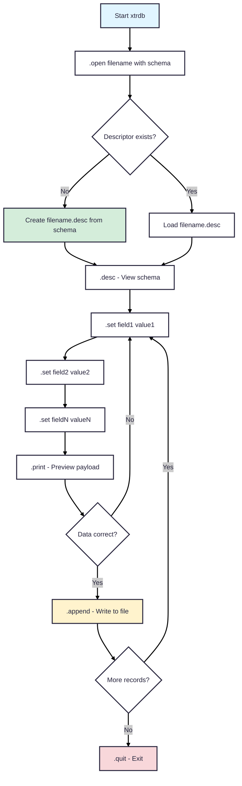
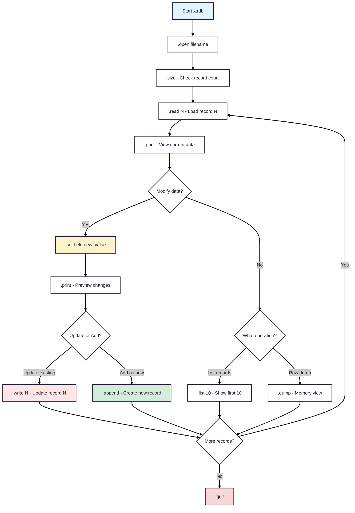
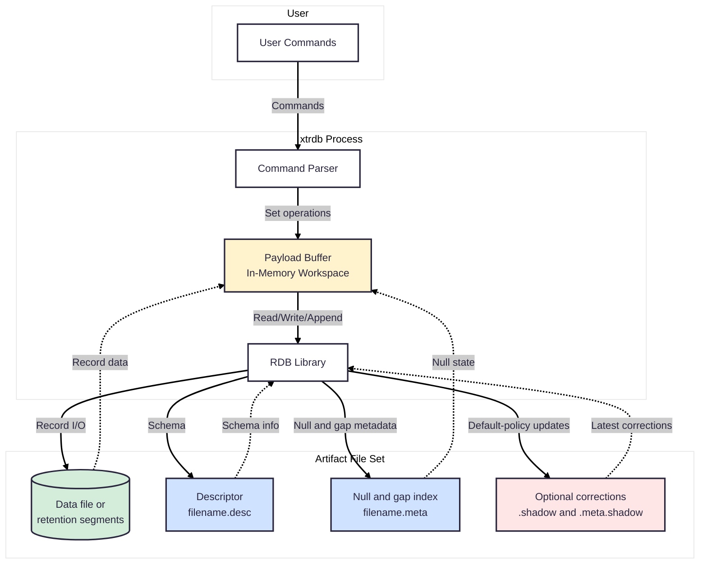
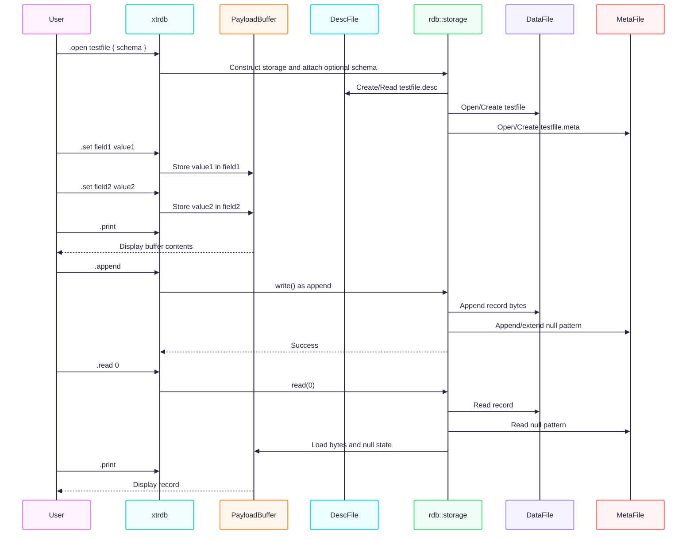
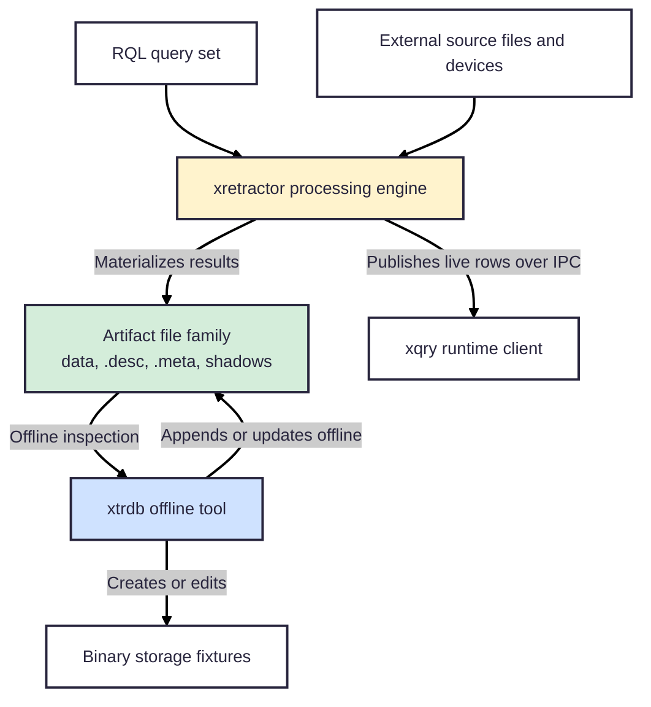
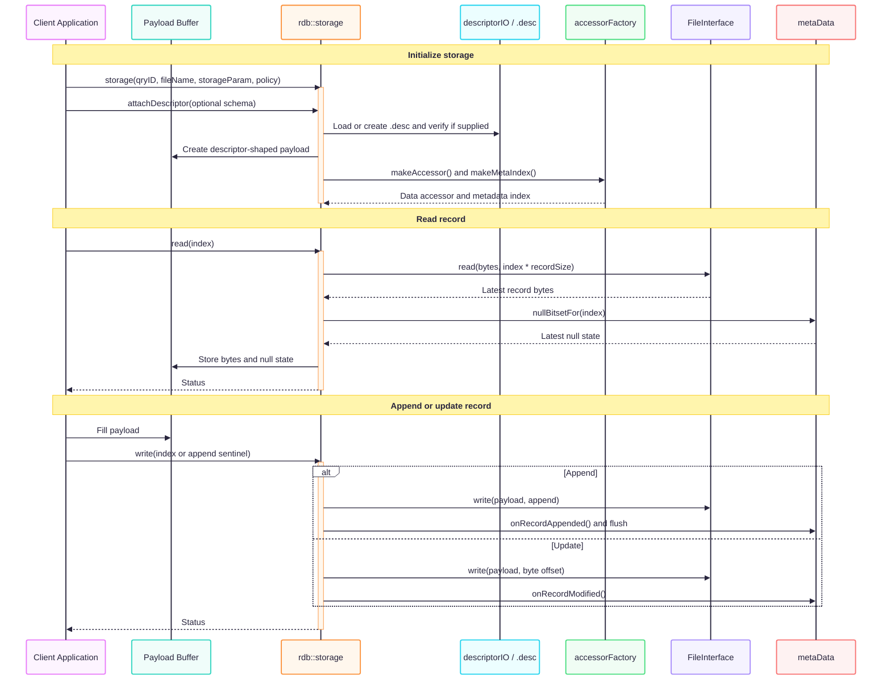
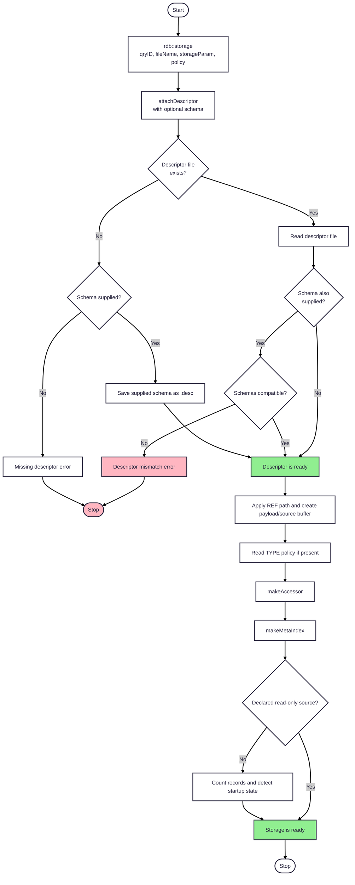

# [RetractorDB](../README.md):xtrdb

[comment]: # (VSCode view: Ctrl+k,v)

## xtrdb - Binary Data Accessor and Testing Tool

**xtrdb** is an interactive terminal-based tool for accessing, inspecting, and modifying RetractorDB artifacts and substrates. It provides a database-like interface for fixed-record time series stored in RetractorDB's native format.

> :warning: **This is work in progress**: This readme can be outdated.

### Purpose

The `xtrdb` tool serves several key functions:
- **Artifact Inspection**: Examine binary data files generated by xretractor
- **Metadata Analysis**: View and verify data structure schemas
- **Test Fixture Creation**: Generate and edit binary fixtures for storage and integration tests
- **Data Verification**: Validate query results and system behavior
- **Debugging**: Investigate data processing issues

### Key Features

- **Interactive Terminal**: Command-line interface with dot prompt (`.`)
- **Schema Management**: Define and inspect data structures
- **Record Operations**: Create storage, read, append, update, and purge records
- **Storage Types**: Work with the data types accepted by the descriptor grammar
- **Artifact File Set**: Manage the data file, `.desc` schema, `.meta` null/gap index, and optional shadow files
- **Deterministic Testing**: Create reproducible test scenarios

> `xtrdb` refuses to enter interactive mode while any `xretractor` instance is running - unnamed, named (`--name`) or under `RDB_NAMESPACE`. It looks for held `xretractor_service*.lock` files in the lock directory of the same configuration the engine reads (`paths.lock_dir`, otherwise `TMPDIR`). An engine started with `--config` pointing at another `lock_dir`, or with a different `TMPDIR`, stays invisible, so stop any engine that owns the target files before inspecting or modifying them offline.

## Supported Data Types

The descriptor grammar used by `xtrdb` accepts the following data field types:

| Type | Size (bytes) | Range | Description |
| ---  | ---: | --- | --- |
| BYTE  | 1 | 0..255 | 8-bit unsigned byte |
| INTEGER | 4 | -2,147,483,648 to 2,147,483,647 | Signed 32-bit integer |
| UINT | 4 | 0 to 4,294,967,295 | Unsigned 32-bit integer |
| RATIONAL | 8 | Two signed 32-bit integers | Exact numerator/denominator pair |
| STRING | [declared] | Bytes | Fixed-size character array |
| FLOAT | 4 | IEEE-754 binary32 | Single precision floating point |
| DOUBLE | 8 | IEEE-754 binary64 | Double precision floating point |

**Table 1**: Data field types accepted by the xtrdb descriptor grammar

### Type Notes

- **STRING**: Must specify array size at declaration (e.g., `STRING name[10]`)
- **BYTE arrays**: Can be used for raw binary data (e.g., `BYTE data[3]`)
- **RATIONAL**: Stored as normalized `int32` numerator and denominator values
- **Arrays**: Numeric declarations such as `INTEGER values[3]` contain three values; `STRING name[10]` is one ten-byte value
- **Layout**: Records are fixed-size and headerless; fields are stored consecutively in the native representation
- **Positional access**: Prefer `set` for general input; `setpos` currently handles only BYTE, INTEGER, DOUBLE, and STRING fields

## Command-line Modes

```
xtrdb -h
xtrdb -n
xtrdb -s datafile
```

- `-h` / `--help` prints the command-line help and exits.
- `-n` / `--noprompt` suppresses the prompt, colours, and `ok` responses for scripted input. The legacy positional spelling `xtrdb noprompt` is also accepted.
- `-s <file>` / `--storagemap <file>` prints the storage-family map for the named data file and exits without starting the interactive terminal.

## Interactive Terminal Interface

### Starting xtrdb

Launch the interactive terminal:
```bash
$ xtrdb
.                               # Dot prompt indicates ready for commands
```

### Available Commands

At the `.` prompt, type `help` (shown as `.help` below) to see all available commands:

```
.help
exit|quit|q                      Exit xtrdb terminal
quitdrop|qd                      Exit and remove base data, .desc, .meta, and .meta.shadow
storage [path]                  Set storage path for database
policy [name]                   Set storage policy
open file [schema]               Open existing file or create new with schema
                                 Example: .open test_db { INTEGER data STRING name[3] }
dropfile [file1] [file2] ... }   Remove listed files; end the list with }
desc|descc                       Display schema (multiline/compact)
read|rread [n]                   Read record from the start/end into the payload
write [n]                        Write payload buffer to record number n
append                           Append payload buffer as new record
purge                            Remove all records
set [field] [value]              Set field value in payload buffer
setpos [position] [num value]    Set field at position to value
getpos [position]                Display field value at position
status                           Show current payload buffer status
rox                              Toggle "remove on exit" flag
print|printt                     Display payload (multiline/single-line)
list|rlist [count]               List first/last records
input [[field][value]]           Fill payload with values
hex|dec                          Toggle hex/decimal display mode
size                             Show total records in database
cap [value]                      Set stream backread capacity
dump                             Show raw payload memory dump
meta                             Show null/gap metadata index
metaraw                          Show internal `.meta` entries
echo                             Print message to terminal
system                           Execute a system command
#|rem [text]                     Comment line
help|h                           Show help
.
```

### Command Categories

**File Operations:**
- `open`, `storage`, `policy` - Select and open or create storage
- `purge`, `dropfile` - Remove records or explicitly named files
- `exit`, `quit`, `quitdrop` - Close and exit

**Schema Operations:**
- `desc`, `descc` - View structure
- `size` - Get record count

**Data Operations:**
- `read`, `rread`, `write`, `append` - Record I/O
- `list`, `rlist` - Bulk viewing

**Payload Buffer:**
- `set`, `setpos`, `getpos`, `input` - Modify or inspect fields
- `print`, `printt` - Display
- `status` - View state
- `dump` - Raw memory view

**Metadata:**
- `meta` - View null patterns and transmission gaps
- `metaraw` - View the binary `.meta` entry structure

Supply a schema to `open` only when the corresponding `.desc` file does not exist. When it already exists, use `open file` and let `xtrdb` load that descriptor.

`policy` accepts `DEFAULT`, `DIRECT`, `MEMORY`, `POSIX`, `POSIXSHD`, `GENERIC`, `DEVICE`, and `TEXTSOURCE` (case-insensitive). `DEVICE` and `TEXTSOURCE` are read-only source accessors. A `TYPE` entry loaded from an existing descriptor overrides the policy selected at the prompt.

`quitdrop` removes the base data file, `.desc`, `.meta`, and `.meta.shadow`. It is not a complete artifact-family cleanup: a data `.shadow` file and retention segments can remain. Use `dropfile { file1 file2 ... }` to remove explicitly named leftovers after verifying that no running `xretractor` instance owns them.

## Usage Examples

### Example 1: Creating a New Storage File

This example demonstrates creating a new binary storage file with a complex schema.

**What this example shows:**
- Schema definition syntax
- Multiple data types in one record
- File creation process
- Automatic descriptor file generation

```bash
$ xtrdb
.open testfile { STRING name[5] BYTE data[3] BYTE control INTEGER intdata FLOAT measurement }
ok                              # File created successfully

.desc                            # Display the schema we just created
{       STRING name[5]          # 5-character string field
        BYTE data[3]            # Array of 3 bytes (e.g., sensor readings)
        BYTE control            # Single control byte (flags, status)
        INTEGER intdata         # 32-bit signed integer
        FLOAT measurement       # Floating point measurement value
}
```

**Files created:**
- `testfile` - Binary data file (records)
- `testfile.desc` - Text descriptor file (schema metadata)
- `testfile.meta` - Null and transmission-gap metadata index
- `testfile.shadow` - Correction file used by the default storage policy

**Use case:** Creating test data for a multi-sensor monitoring system where each record contains sensor name, raw data bytes, control flags, integer counters, and floating-point measurements.

### Example 2: Adding Data to Storage

This example shows how to populate a storage file with data using the payload buffer.

**What this example shows:**
- Opening an existing file
- Setting individual field values
- Using the payload buffer
- Appending records
- Different data type assignments

```bash
$ xtrdb
.open testfile                   # Open previously created file
ok

.desc                            # Verify the schema
{       STRING name[5]
        BYTE data[3]
        BYTE control
        INTEGER intdata
        FLOAT measurement
}

# Build a record in the payload buffer (in-memory workspace)
.set name test1                  # Set string field to "test1"
.set data 5 7 8                  # Set byte array to values [5, 7, 8]
.set control 233                 # Set control byte to 233 (0xE9)
.set intdata 345678              # Set integer to 345678
.set measurement 3.1415926       # Set float to π approximation

.print                           # Display payload buffer contents
{       name:test1               # String value
        data:5 7 8               # Byte array values (space-separated)
        control:233              # Control byte
        intdata:345678           # Integer value
        measurement:3.14159      # Float (note: precision limitation)
}

.append                          # Write payload buffer to file as new record
ok                               # Record #0 successfully written
```

**Workflow explanation:**
1. **Payload Buffer**: Acts as a working area (like a clipboard)
2. **Set Operations**: Modify fields in buffer, not in file yet
3. **Append**: Commits buffer contents to file as a new record

**Use case:** Assembling binary fixtures for storage tests or manually creating calibration records.

### Example 3: Reading and Modifying Existing Data

This example demonstrates reading records, modifying them, and understanding the difference between `write` and `append`.

**What this example shows:**
- Reading existing records by index
- Modifying fields in the payload buffer
- The difference between `write` (update) and `append` (add new)
- Non-destructive read operations

```bash
$ xtrdb
.open testfile
ok

.read 0                          # Read record #0 into payload buffer
ok                               # Record successfully loaded

.print                           # Display what we just read
{       name:test1               # Original data from record #0
        data:5 7 8
        control:233
        intdata:345678
        measurement:3.14159
}

.set name test2                  # Change name field (only in buffer!)
.print                           # Show modified buffer
{       name:test2               # Name changed to "test2"
        data:5 7 8               # Other fields unchanged
        control:233
        intdata:345678
        measurement:3.14159
}

.append                          # Add as NEW record (not update!)
ok                               # Creates record #1 with "test2"

.read 0                          # Read original record again
ok
.print                           # Verify record #0 is unchanged
{       name:test1               # Still "test1" - append didn't modify it!
        data:5 7 8
        control:233
        intdata:345678
        measurement:3.14159
}
.
```

**Key concepts:**
- **read [n]**: Loads record n into payload buffer (non-destructive)
- **append**: Adds buffer as NEW record at end of file
- **write [n]**: Logically updates existing record n; with the default policy, the correction is appended to shadow files
- Records are 0-indexed: first record is 0, second is 1, etc.

**Important distinction:**
```
.append    → Creates new record (record count increases)
.write 0   → Updates record #0 (record count stays same)
```

**Use case:** Inspecting query output artifacts, creating variations of test data, or debugging data transformation issues.

## Usage Workflows

### Workflow 1: Creating and Populating a New Storage File


```mermaid
%%{init: {'theme': 'redux-color', "flowchart" : { "curve" : "basis" } } }%%
flowchart TD
    A[Start xtrdb] --> B[.open filename with schema]
    B --> C{Descriptor exists?}
    C -->|No| D[Create filename.desc from schema]
    C -->|Yes| E[Load filename.desc]
    D --> F[.desc - View schema]
    E --> F
    F --> G[.set field1 value1]
    G --> H[.set field2 value2]
    H --> I[.set fieldN valueN]
    I --> J[.print - Preview payload]
    J --> K{Data correct?}
    K -->|No| G
    K -->|Yes| L[.append - Write to file]
    L --> M{More records?}
    M -->|Yes| G
    M -->|No| N[.quit - Exit]
    
    style A fill:#e1f5ff
    style D fill:#d4edda
    style L fill:#fff3cd
    style N fill:#f8d7da
```

**Process:**
1. Start xtrdb terminal
2. Open/create file with schema definition
3. Set field values in payload buffer
4. Preview with `.print`
5. Append to file when satisfied
6. Repeat for multiple records

### Workflow 2: Reading and Modifying Records


```mermaid
%%{init: {'theme': 'redux-color', "flowchart" : { "curve" : "basis" } } }%%
flowchart TD
    A[Start xtrdb] --> B[.open filename]
    B --> C[.size - Check record count]
    C --> D[.read N - Load record N]
    D --> E[.print - View current data]
    E --> F{Modify data?}
    F -->|Yes| G[.set field new_value]
    F -->|No| H{What operation?}
    G --> I[.print - Preview changes]
    I --> J{Update or Add?}
    J -->|Update existing| K[.write N - Update record N]
    J -->|Add as new| L[.append - Create new record]
    K --> M{More records?}
    L --> M
    H -->|List records| N[.list 10 - Show first 10]
    H -->|Raw dump| O[.dump - Memory view]
    N --> M
    O --> M
    M -->|Yes| D
    M -->|No| P[.quit]
    
    style A fill:#e1f5ff
    style G fill:#fff3cd
    style K fill:#ffe6e6
    style L fill:#d4edda
    style P fill:#f8d7da
```

**Process:**
1. Open existing file
2. Check size/browse records
3. Load specific record
4. Modify if needed
5. Write back or append new
6. Repeat as needed

### Workflow 3: xtrdb Architecture and Data Flow


```mermaid
%%{init: {'theme': 'redux-color', "flowchart" : { "curve" : "basis" } } }%%
flowchart TD
    subgraph User
        A[User Commands]
    end
    
    subgraph xtrdb["xtrdb Process"]
        B[Command Parser]
        C[Payload Buffer<br/>In-Memory Workspace]
        D[RDB Library]
    end
    
    subgraph Storage["Artifact File Set"]
        E[(Data file or<br/>retention segments)]
        F[Descriptor<br/>filename.desc]
        G[Null and gap index<br/>filename.meta]
        H[Optional corrections<br/>.shadow and .meta.shadow]
    end
    
    A -->|Commands| B
    B -->|Set operations| C
    C -->|Read/Write/Append| D
    D -->|Record I/O| E
    D -->|Schema| F
    D -->|Null and gap metadata| G
    D -->|Default-policy updates| H
    E -.->|Record data| C
    F -.->|Schema info| D
    G -.->|Null state| C
    H -.->|Latest corrections| D
    
    style C fill:#fff3cd
    style E fill:#d4edda
    style F fill:#cfe2ff
    style G fill:#cfe2ff
    style H fill:#ffe6e6
```

**Components:**
- **Command Parser**: Interprets user commands
- **Payload Buffer**: In-memory staging area for records
- **RDB Library**: `rdb::storage`, payload, accessor, and metadata-index logic
- **Data Storage**: Main data file or retention segments, depending on policy
- **Descriptor File**: Text schema and storage configuration
- **Metadata and Shadows**: Null/gap index plus optional non-destructive corrections

### Workflow 4: Operation Sequence Diagram


```mermaid
%%{init: {'theme': 'redux-color', "flowchart" : { "curve" : "basis" } } }%%
sequenceDiagram
    participant User
    participant xtrdb
    participant PayloadBuffer
    participant DescFile
    participant Storage as rdb::storage
    participant DataFile
    participant MetaFile
    
    User->>xtrdb: .open testfile { schema }
    xtrdb->>Storage: Construct storage and attach optional schema
    Storage->>DescFile: Create/Read testfile.desc
    Storage->>DataFile: Open/Create testfile
    Storage->>MetaFile: Open/Create testfile.meta
    
    User->>xtrdb: .set field1 value1
    xtrdb->>PayloadBuffer: Store value1 in field1
    
    User->>xtrdb: .set field2 value2
    xtrdb->>PayloadBuffer: Store value2 in field2
    
    User->>xtrdb: .print
    PayloadBuffer-->>User: Display buffer contents
    
    User->>xtrdb: .append
    xtrdb->>Storage: write() as append
    Storage->>DataFile: Append record bytes
    Storage->>MetaFile: Append/extend null pattern
    Storage-->>xtrdb: Success
    
    User->>xtrdb: .read 0
    xtrdb->>Storage: read(0)
    Storage->>DataFile: Read record #0
    Storage->>MetaFile: Read null pattern #0
    Storage->>PayloadBuffer: Load bytes and null state
    
    User->>xtrdb: .print
    PayloadBuffer-->>User: Display record #0
```

**Interaction flow:**
1. File opening loads or creates the descriptor, data storage, and metadata index
2. Set commands modify only the payload buffer (non-persistent)
3. Append/write operations commit record bytes and null metadata; default-policy updates use shadows
4. Read operations combine the latest data and null state in the payload buffer
5. Print always displays current buffer state

## Advanced Usage Examples

### Example 4: Working with Byte Arrays

```bash
$ xtrdb
.open sensor_data { STRING id[4] BYTE readings[8] }
ok

# Decimal mode (default)
.dec
.set id SNS1
.set readings 10 20 30 40 50 60 70 80    # Decimal byte values
.print
{       id:SNS1
        readings:10 20 30 40 50 60 70 80
}
.append
ok

# Hexadecimal mode
.hex
.read 0
.print
{       id:SNS1
        readings:0a 14 1e 28 32 3c 46 50  # Same values in hex
}
```

**What this shows:**
- Byte arrays for sensor data
- Switching between decimal and hexadecimal display
- `.hex` and `.dec` commands toggle display mode

### Example 5: Listing and Browsing Records

```bash
$ xtrdb
.open temperature { INTEGER timestamp FLOAT temp_celsius }
ok

# Add several records...
.set timestamp 1000
.set temp_celsius 22.5
.append
ok

.set timestamp 1001
.set temp_celsius 23.1
.append
ok

.set timestamp 1002
.set temp_celsius 21.8
.append
ok

# View all records from start
.list 10                         # List first 10 records
{ timestamp:1000 temp_celsius:22.5 }
{ timestamp:1001 temp_celsius:23.1 }
{ timestamp:1002 temp_celsius:21.8 }

# View from end
.rlist 2                         # List last 2 records (reverse)
{ timestamp:1002 temp_celsius:21.8 }
{ timestamp:1001 temp_celsius:23.1 }

# Check total count
.size
3 Record(s)                      # Total records in file
8 Byte(s) per record.
```

**What this shows:**
- `.list N` - Forward listing from start
- `.rlist N` - Reverse listing from end
- `.size` - Total record count
- Useful for verifying data population

### Example 6: Creating a Binary Test Fixture

**Scenario:** Create deterministic records for a storage or integration test

```bash
$ xtrdb
.open input_stream { INTEGER value }
ok

# Create ascending sequence for testing
.set value 1
.append
ok

.set value 2
.append
ok

.set value 3
.append
ok

.set value 4
.append
ok

.set value 5
.append
ok

.list 5
{ value:1 }
{ value:2 }
{ value:3 }
{ value:4 }
{ value:5 }
```

**Use case:** Creating a deterministic binary fixture whose contents can be compared with expected records.

> An `.desc` file created by `xtrdb` describes writable storage. It is not a `DECLARE` source descriptor, which additionally contains `REF` and `TYPE DEVICE` or `TYPE TEXTSOURCE`; do not reuse it unchanged as a query input descriptor.

## Practical Use Cases

### 1. **Test Data Generation**
Create reproducible binary fixtures for storage and integration tests:
- Sensor simulation data
- Edge case scenarios
- Performance benchmarking datasets

### 2. **Artifact Inspection**
Examine output from xretractor queries:
```bash
$ xretractor query.rql --no-clock --llimitqry 10  # Run 10 processing-loop iterations
$ xtrdb
.open output_stream              # Inspect generated artifact
.list 5                          # View first 5 results
```

### 3. **Data Validation**
Verify query results match expected output:
- Read output artifacts
- Compare field values
- Check data types and ranges

### 4. **Debugging**
Investigate data processing issues:
- Use `.dump` for raw memory view
- Check schema with `.desc`
- Verify record structure

### 5. **Batch Inspection**
Run repeatable command scripts with `xtrdb -n` and capture their text output for comparison.

### 6. **Query Development**
Iterative query development:
1. Prepare source data in the format declared by the RQL query
2. Run query with xretractor
3. Inspect output with xtrdb
4. Refine query logic
5. Repeat

## Best Practices

### DO:
- ✅ Use `.desc` to verify schema before operations
- ✅ Use `.print` to preview before `.append`
- ✅ Use `.size` to check record count
- ✅ Treat data, `.desc`, `.meta`, and shadow files as one artifact family
- ✅ Check for shadow and retention files after using `.quitdrop`
- ✅ Use meaningful field names in schemas
- ✅ Test with small datasets first

### DON'T:
- ❌ Mix `.write` and `.append` without understanding difference
- ❌ Delete .desc files manually (breaks schema)
- ❌ Run `xtrdb` against files owned by a running `xretractor` instance
- ❌ Use very large STRING arrays unnecessarily
- ❌ Assume float precision is exact

## Tips and Tricks

### Quick Record Creation
```bash
# Example schema: { INTEGER timestamp DOUBLE value }

# Method 1: Named fields
.set timestamp 1000
.set value 12.5
.append

# Method 2: Descriptor positions (zero-based)
.setpos 0 1001
.setpos 1 13.25
.append
```

### Batch Operations
```bash
# Create multiple similar records quickly
.set timestamp 1000
.set value 10
.append
.set timestamp 1001    # Only change what differs
.append
.set timestamp 1002
.append
```

### Inspecting Large Files
```bash
.size                  # Get total count first
.list 10               # Sample from start
.rlist 10              # Sample from end
.read 0                # Check first record details
```

### Schema Reuse
```bash
# Descriptor files already contain reusable text schemas.
$ cp myfile.desc newfile.desc

# xtrdb reads newfile.desc and creates/opens the corresponding data storage.
$ xtrdb
.open newfile
```

## Troubleshooting

| Problem | Solution |
|---------|----------|
| "No such file" error | Check filename, create with `.open file { schema }` |
| Schema mismatch | Verify .desc file matches data file |
| Values not saving | Ensure you used `.append` or `.write` |
| Wrong data displayed | Check if you need `.hex` or `.dec` mode |
| Can't modify record | Use `.read N` first, then `.set`, then `.write N` |

## Storage Notes

- **Memory**: Payload buffer size depends on schema complexity
- **Record addressing**: A record starts at `index * descriptor record size`
- **Updates**: The default policy keeps corrections in `.shadow` and `.meta.shadow`
- **Retention**: Some policies split data into segments instead of one file

## Integration with RetractorDB

xtrdb complements the RetractorDB ecosystem:


```mermaid
%%{init: {'theme': 'redux-color', "flowchart" : { "curve" : "basis" } } }%%
flowchart TD
    RQL[RQL query set] --> XR[xretractor processing engine]
    SRC[External source files and devices] --> XR
    XR -->|Materializes results| ART[Artifact file family<br/>data, .desc, .meta, shadows]
    XR -->|Publishes live rows over IPC| XQ[xqry runtime client]
    XT[xtrdb offline tool] -->|Creates or edits| FIX[Binary storage fixtures]
    XT -->|Appends or updates offline| ART
    ART -->|Offline inspection| XT

    style XR fill:#fff3cd
    style ART fill:#d4edda
    style XT fill:#cfe2ff
```

`xqry` consumes live rows through IPC; it does not read artifact files. `xtrdb` works on persisted files offline and must not access files owned by any running engine instance.

## RDB Library Diagrams

### RDB Communication Process - Sequence Diagram

This diagram shows the interaction between components during storage operations.


```mermaid
%%{init: {'theme': 'redux-color', "flowchart" : { "curve" : "basis" } } }%%
sequenceDiagram
    participant Client as Client Application
    participant Payload as Payload Buffer
    participant Rdb as rdb::storage
    participant Description as descriptorIO / .desc
    participant Factory as accessorFactory
    participant Data as FileInterface
    participant Meta as metaData
    
    Note over Client,Meta: Initialize storage
    Client->>Rdb: storage(qryID, fileName, storageParam, policy)
    activate Rdb
    Client->>Rdb: attachDescriptor(optional schema)
    Rdb->>Description: Load or create .desc and verify if supplied
    Rdb->>Payload: Create descriptor-shaped payload
    Rdb->>Factory: makeAccessor() and makeMetaIndex()
    Factory-->>Rdb: Data accessor and metadata index
    deactivate Rdb
    
    Note over Client,Meta: Read record
    Client->>Rdb: read(index)
    activate Rdb
    Rdb->>Data: read(bytes, index * recordSize)
    Data-->>Rdb: Latest record bytes
    Rdb->>Meta: nullBitsetFor(index)
    Meta-->>Rdb: Latest null state
    Rdb->>Payload: Store bytes and null state
    Rdb-->>Client: Status
    deactivate Rdb
    
    Note over Client,Meta: Append or update record
    Client->>Payload: Fill payload
    Client->>Rdb: write(index or append sentinel)
    activate Rdb
    alt Append
        Rdb->>Data: write(payload, append)
        Rdb->>Meta: onRecordAppended() and flush
    else Update
        Rdb->>Data: write(payload, byte offset)
        Rdb->>Meta: onRecordModified()
    end
    Rdb-->>Client: Status
    deactivate Rdb
```

**Key interactions:**
1. **Initialization**: Resolve the descriptor and construct the selected data accessor, metadata index, and payload
2. **Read Data**: Combine the latest record bytes with the corresponding null state
3. **Write Data**: Append or update both record data and metadata; shadow-capable policies preserve corrections separately

### Storage Accessor - Activity Diagram

This diagram illustrates the current `rdb::storage` initialization process.


```mermaid
%%{init: {'theme': 'redux-color', "flowchart" : { "curve" : "basis" } } }%%
flowchart TD
    Start([Start]) --> A[rdb::storage<br/>qryID, fileName, storageParam, policy]
    
    A --> B[attachDescriptor<br/>with optional schema]
    
    B --> C{Descriptor file<br/>exists?}
    
    C -->|Yes| D[Read descriptor file]
    C -->|No| E{Schema supplied?}
    
    D --> F{Schema also<br/>supplied?}
    F -->|Yes| G{Schemas compatible?}
    F -->|No| K[Descriptor is ready]
    G -->|Yes| K
    G -->|No| H[Descriptor mismatch error]
    H --> Stop1([Stop])
    E -->|No| I[Missing descriptor error]
    I --> Stop1
    E -->|Yes| J[Save supplied schema as .desc]
    J --> K

    K --> L[Apply REF path and create payload/source buffer]
    L --> M[Read TYPE policy if present]
    M --> N[makeAccessor]
    N --> O[makeMetaIndex]
    O --> P{Declared read-only source?}
    P -->|Yes| R[Storage is ready]
    P -->|No| Q[Count records and detect startup state]
    Q --> R
    R --> Stop2([Stop])
    
    style K fill:#90EE90
    style R fill:#90EE90
    style H fill:#FFB6C1
    style Stop1 fill:#FFB6C1
```

**Process steps:**
1. **Initialization**: Construct `rdb::storage` with logical and physical paths
2. **Descriptor Resolution**: Load an existing `.desc` or require and save a supplied schema
3. **Descriptor Validation**: Check a supplied schema against an existing descriptor
4. **Storage Attachment**: Select the data accessor and matching metadata-index variant
5. **Payload Setup**: Create the payload and source buffer before exposing the ready storage

These diagrams show the low-level implementation details of RetractorDB's storage layer.

## Summary

**xtrdb** is an essential tool in the RetractorDB ecosystem for:
- Creating and managing binary test fixtures
- Inspecting query results
- Debugging data processing
- Validating system behavior

Its interactive and batch modes support development, reproducible tests, and offline diagnostics of persisted storage.

For more information about RetractorDB, see the [main documentation](../README.md).
